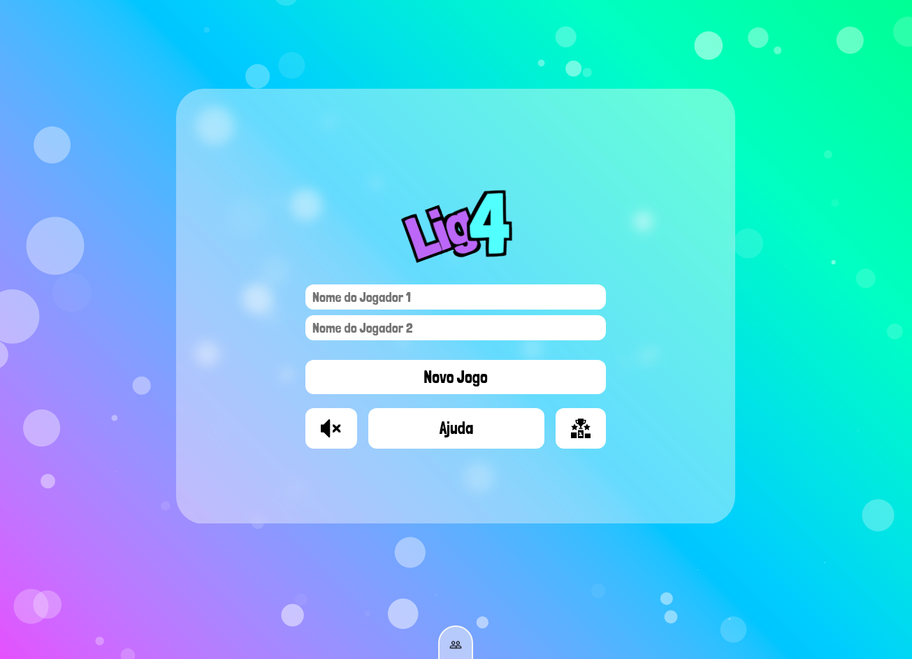

<p align="center">
  
</p>
<br>
<hr>

<h1 align="center">
  Projeto: LIG 4
</h1>
<br>

<blockquote align="center">“Criatividade e inovação só podem florescer quando você abraça a diferença das pessoas.”

(Wenderson Gomes)</blockquote>
<br>


<p align="center">

  <a href="LICENSE">
    
  </a>
  <a href="NPM">
    
  </a>
  <a href="GitHub followers">
    
  </a>
</p>
<hr>
<br>
<br>

# :rocket: Sobre o projeto

O LIG-4 é um jogo que tem como objetivo colocar quatro peças numa linha contínua vertical, horizontal ou diagonal. O jogo desenrola-se num tabuleiro de 7x6 e começa com o tabuleiro em branco. 

O ponto alto deste projeto, que foi proposto dentro do curso de Desenvolvimento Full-Stack da Kenzie Academy, foi a oportunidade de trabalhar em grupo, seguindo a metologia SCRUM de gestão e planejamento.

**O LIG-4 é um projeto realizado dentro do curso de desenvolvimento full-stack da Kenzie Academy Brasil.**

<br>

## :computer: Tecnologias utilizadas
A seguinte stack foi utilizada na construção do projeto:

- HTML
- CSS
- JavaScript
- Particles.JS

<br>

## :construction_worker: Clone!

<br />

```
git clone https://github.com/BrunoBelarminoNog/lig-4.git
```

URLs SSH fornecem acesso a um repositório Git via SSH, um protocolo seguro. Se você tiver uma chave SSH registrada em
sua conta do Github, clone o projeto usando este comando:

```
git clone git@github.com:BrunoBelarminoNog/lig-4.git
```

<br>


# :art: Layout

<br />
<p align="center">
  
</p>
<br />


# :pushpin: Contribuindo

Sinta-se à vontade para registrar um novo problema com o respectivo título e descrição no repositório Lig-4 . Se você já encontrou uma solução para o problema, eu adoraria revisar sua solicitação de pull!

Verifique a página de contribuição para ver os melhores lugares para registrar problemas, iniciar discussões e começar a contribuir.


# :unlock: Licença
Lançado em 2021. Este projeto está sob a licença do MIT .

Feito com muita dedicação por Bruno Belarmino :zap:

Me siga nas redes! [LinkdIn](https://www.linkedin.com/in/bruno-belarmino-nog/)
